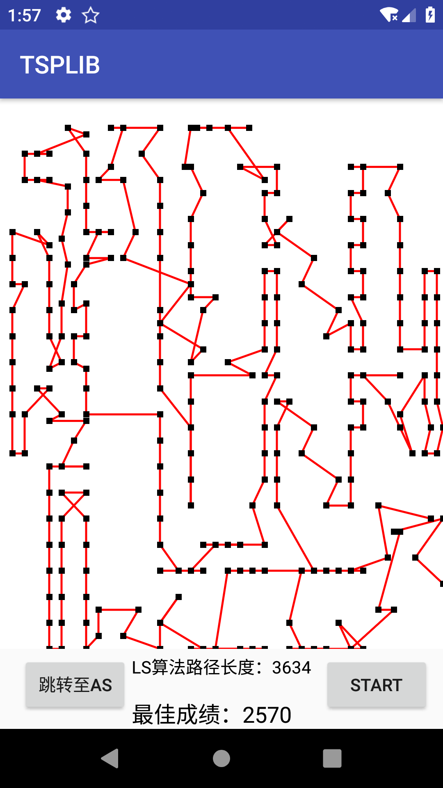
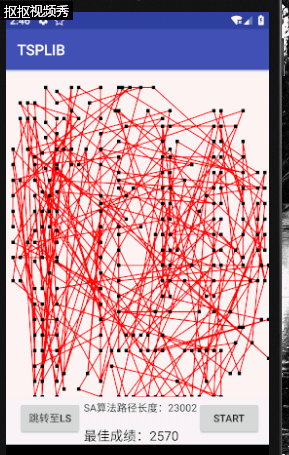
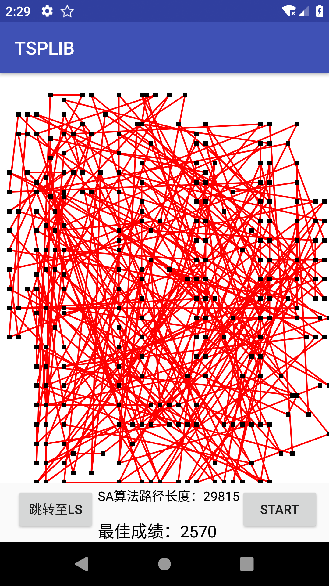
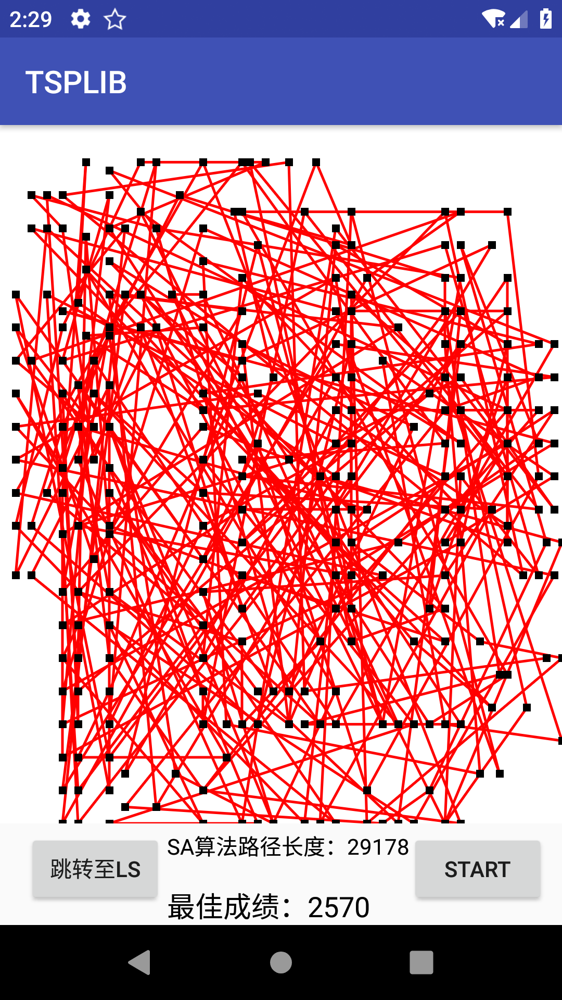
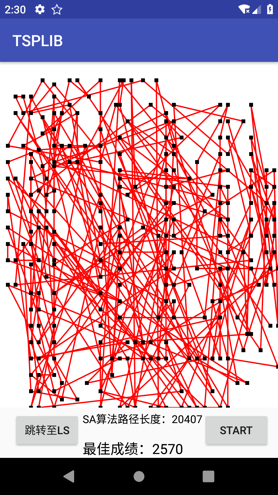
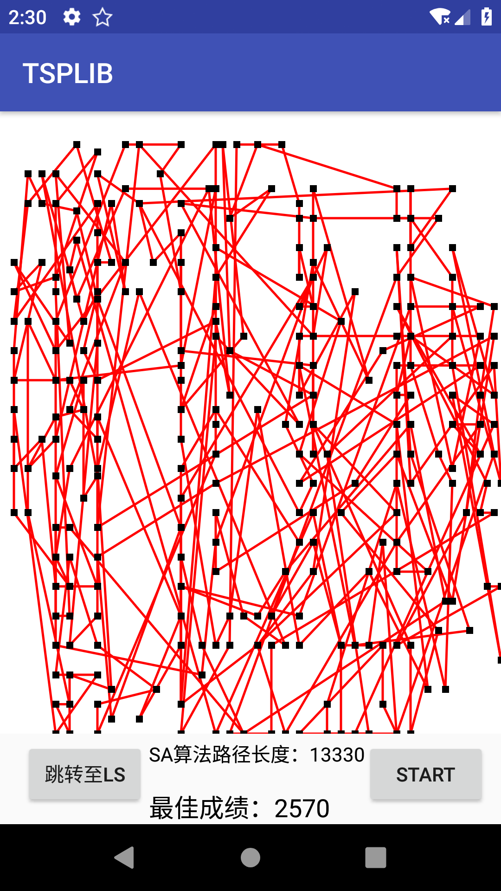
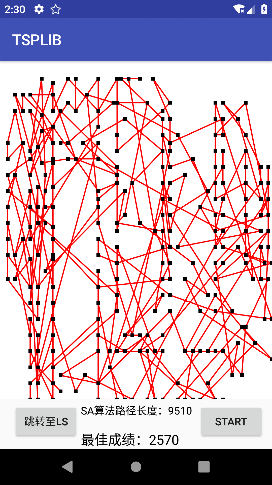
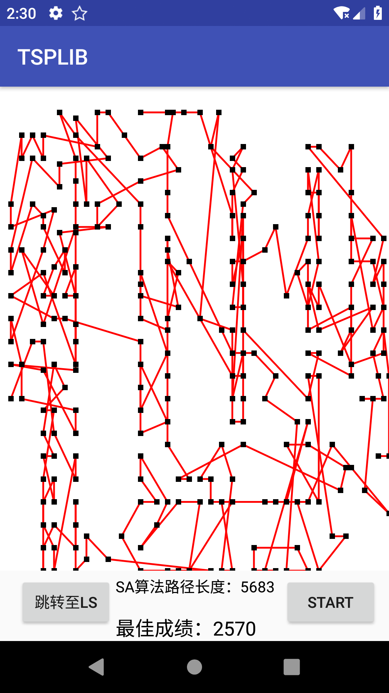

# TSPLIB

## 整体界面

## 操作细则
- 点击左下角按钮进行local search和simulated Annealing的切换
- 点击右下角按钮开启simulated Annealing的运算
- 由于时间关系，对一些操作细节未进行处理，所以建议在开启simulated Annealing的运算之后不要继续操作，直到等simulated Annealing运算完成。否则会出现多个simulated Annealing同时运行。

## 细节

- simulated Annealing方面技术细节
    1.  对k=1，……，L做第(2)至第5步
    2. 产生新解s′，利用二变换法和三变换法产生新解
    3. 计算增量cost=cost(s′)-cost(s)，其中cost(s)为评价函数
    4. 若t<0则接受s′作为新的当前解，否则以概率exp(-t′/T)接受s′作为新的当前解
    5. 如果满足终止条件则输出当前解作为最优解，结束程序。终止条件通常取为连续若干个新解都没有被接受时终止算法
    6. T逐渐减少，且T趋于0，结束
    
- android方面技术细节
    - 利用canvas+paint实现画面绘图
    - 利用Thread实现simulated Annealing的长时间运行与主线程同步运行
    - 利用handler的post实现线程间通信
    - 利用postInvalidate()实现画面动态更新

## 结果
### local search

### simulated Annealing

